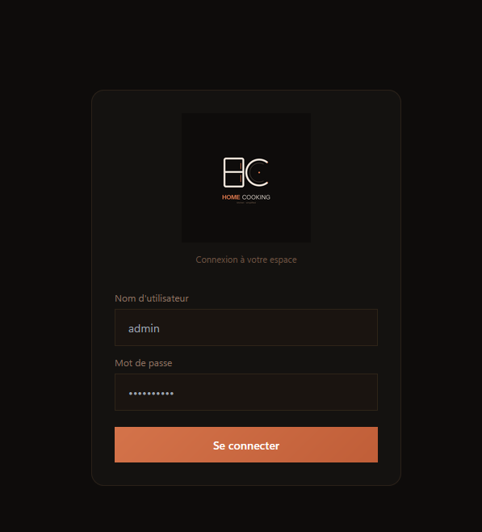
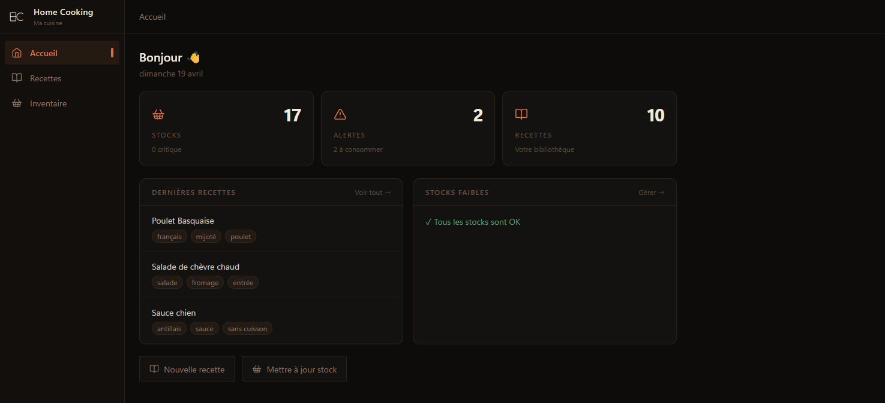
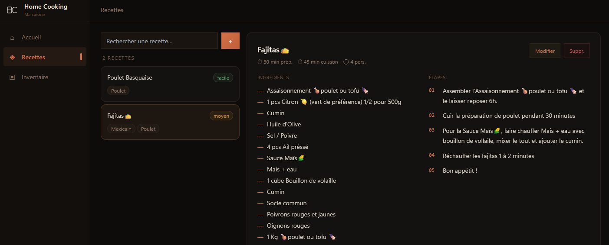
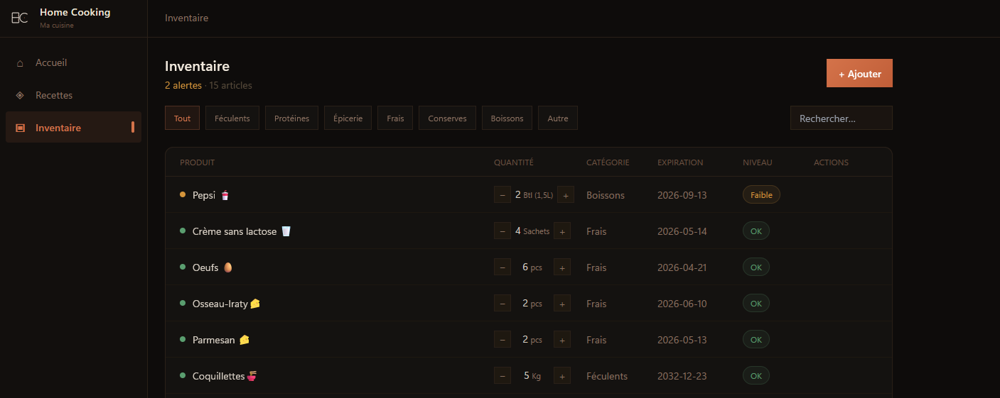
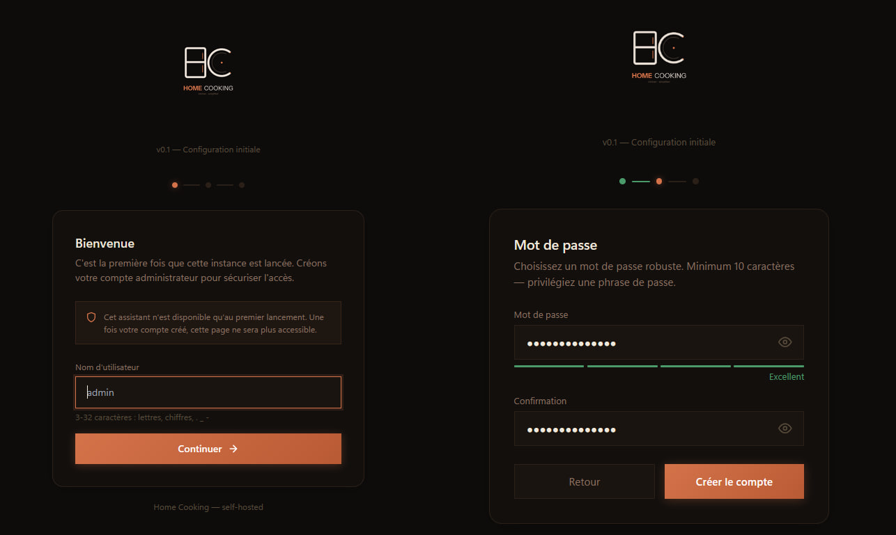

<div align="center">
  
  <br /><br />
  <em>Gestion de cuisine auto-hébergée - recettes, garde-manger et liste de courses en un seul endroit.</em>
  <br /><br />
  Une application web personnelle pour gérer votre bibliothèque de recettes et suivre votre inventaire.<br />
  Développée en Go et React, entièrement conteneurisée, aucune dépendance cloud.
  <br /><br />
  <a href="README_EN.md">🇬🇧 English version</a>
</div>

<div align="center">
  
  <br /><br />
  
  &nbsp;
  
  &nbsp;
  
</div>

---

## Fonctionnalités

- **Bibliothèque de recettes** : CRUD complet avec recherche plein texte (SQLite FTS5), ingrédients, instructions étape par étape, difficulté, tags, temps de préparation et de cuisson
- **Inventaire / garde-manger** : suivi des quantités avec ajustements ±1, dates de péremption, filtres par catégorie et alertes de stock bas automatiques
- **Liste de courses** : générée automatiquement à partir des articles en stock bas
- **Authentification sécurisée** : access token JWT courte durée (15 min) + refresh token httpOnly (7 jours) avec révocation côté serveur
- **Responsive** : barre latérale rétractable sur desktop, navigation en bas sur mobile
- **Auto-hébergé** : une seule commande pour démarrer, SQLite pour le stockage, aucun service externe requis

---

## Stack technique

| | Technologie |
|---|---|
| **Frontend** | React 18, TypeScript, Vite, Tailwind CSS |
| **Backend** | Go 1.22, Gin, zerolog |
| **Auth** | JWT HS256 · bcrypt cost 12 · double-token |
| **Base de données** | SQLite : mode WAL, FTS5, migrations embarquées |
| **Proxy** | nginx 1.27 : reverse proxy + serveur SPA |
| **Exécution** | Docker / Podman (compatible rootless) |

Le binaire Go utilise [`modernc.org/sqlite`](https://gitlab.com/cznic/sqlite) ; un driver SQLite pur Go, sans CGO. L'image finale est construite sur `scratch` (zéro OS).

---

## Démarrage rapide

### Prérequis

- [Docker](https://docs.docker.com/get-docker/) ≥ 24 **ou** [Podman](https://podman.io/) ≥ 4 avec `podman-compose`

### 1. Cloner

```bash
git clone https://github.com/Kitslap/HomeCooking.git
cd HomeCooking
```

### 2. Configurer

```bash
cp .env.example .env
```

Éditez `.env` et définissez un secret fort :

```env
JWT_SECRET=votre-secret-long-et-aleatoire   # minimum 32 caractères
LOCAL_IP=192.168.x.x                        # votre IP locale (voir section HTTPS)
```

Ou générer et injecter le secret en une commande :
```bash
echo "JWT_SECRET=$(openssl rand -hex 64)" >> .env
```

> ⚠️ L'application refusera de démarrer si `JWT_SECRET` est absent ou trop court.

### 3. Lancer

**Docker :**
```bash
docker compose up --build -d
```

**Podman :**
```bash
podman compose -f docker-compose.yml up --build -d
```

Ouvrez **https://localhost:3443** pour accéder à l'application (acceptez le certificat auto-signé au premier accès).

### 4. Configuration initiale

Au premier lancement, l'**assistant de configuration** vous guidera pour créer le compte administrateur. Cet assistant n'est disponible qu'une seule fois ; dès que le premier utilisateur est créé, le endpoint `/setup` est verrouillé définitivement.

<div align="center">
  
</div>

Le setup crée un compte admin avec tous les privilèges. Les utilisateurs supplémentaires ne peuvent être créés que par un admin via le endpoint protégé `/auth/register`.

### 5. Démarrer et arrêter

```bash
# Arrêter la stack
docker compose down          # Docker
podman compose down          # Podman

# Redémarrer (sans rebuild)
docker compose up -d         # Docker
podman compose up -d         # Podman
```

> Les données sont persistées dans un volume Docker (`home-cooking-sqlite`). La commande `down` ne supprime pas la base de données. Pour tout réinitialiser : `docker compose down -v`.

---

## HTTPS (certificat auto-signé)

L'application tourne en **HTTPS par défaut** en production grâce à un certificat SSL auto-signé généré automatiquement lors du build Docker. Aucune gestion manuelle de certificat n'est nécessaire.

### Comment ça marche

Au `docker compose up --build`, le Dockerfile du frontend génère un certificat RSA 2048 bits valable 10 ans. Nginx écoute sur le port 443 (HTTPS) et redirige automatiquement le port 80 (HTTP) vers HTTPS.

### Accès depuis un autre appareil du réseau local

Par défaut, le certificat n'est valide que pour `localhost` et `127.0.0.1`. Pour accéder à l'application depuis un autre appareil (téléphone, tablette…), il faut déclarer votre IP locale dans le `.env` **avant le build** :

```env
LOCAL_IP=192.168.1.42
```

Cette IP sera intégrée au certificat SSL (champ SAN) et au CORS du backend. Pour trouver votre IP locale :

```bash
# Linux / macOS
ip route get 1 | awk '{print $7}'
# ou
hostname -I | awk '{print $1}'
```

> ⚠️ Si vous changez d'IP locale, il faut **rebuild** l'image pour régénérer le certificat : `docker compose up --build -d`

### Ports exposés (production)

| Port | Protocole | Comportement |
|------|-----------|-------------|
| `3443` | HTTPS | Point d'entrée principal |
| `3080` | HTTP | Redirige automatiquement vers HTTPS |

Ces ports sont configurables via `FRONTEND_PORT` et `FRONTEND_HTTP_PORT` dans le `.env`.

### Avertissement du navigateur

Au premier accès, le navigateur affichera un avertissement « connexion non sécurisée » — c'est normal pour un certificat auto-signé. Cliquez sur « Avancé » puis « Accepter le risque » (le libellé varie selon le navigateur). L'avertissement ne réapparaîtra plus pour ce domaine.

### Mode développement

Le mode dev (`docker-compose.dev.yml`) reste en **HTTP sur le port 3000**, sans changement de workflow.

---

## Structure du projet

```
HomeCooking/
│
├── backend/                        # API Go
│   ├── cmd/server/main.go          # Point d'entrée, routeur, arrêt gracieux
│   ├── internal/
│   │   ├── auth/                   # JWT, bcrypt, handlers login, inscription admin
│   │   ├── config/                 # Config typée depuis l'environnement
│   │   ├── db/                     # Connexion SQLite + migrations embarquées
│   │   │   └── migrations/         # Fichiers SQL (001_init.sql, …)
│   │   ├── middleware/             # CORS, rate limiter, JWT auth, headers sécu, logger
│   │   ├── recipe/                 # CRUD recettes : handler + repository
│   │   ├── setup/                  # Assistant premier lancement : création compte admin
│   │   └── storage/               # CRUD garde-manger : handler + repository
│   ├── go.mod
│   ├── go.sum
│   └── Dockerfile                  # Multi-stage : golang:alpine → scratch
│
├── frontend/                       # SPA React
│   ├── src/
│   │   ├── pages/                  # Dashboard, Recettes, Inventaire, Auth, Setup
│   │   ├── components/             # Layout, primitives UI
│   │   └── lib/api.ts              # Client HTTP typé
│   ├── docker/nginx.conf           # Config reverse proxy
│   ├── package.json
│   ├── vite.config.ts
│   └── Dockerfile                  # Multi-stage : node:alpine (build) → nginx:alpine
│
├── docker-compose.yml              # Stack production
├── docker-compose.dev.yml          # Overrides développement
├── .env.example                    # Template d'environnement
└── README.md
```

---

## API

Toutes les routes sont préfixées `/api/v1`. Les routes protégées nécessitent `Authorization: Bearer <token>`.

**Setup** (premier lancement uniquement)

| Méthode | Route | Auth | Description |
|---------|-------|:----:|-------------|
| GET | `/setup/status` | | Vérifier si le setup est nécessaire |
| POST | `/setup` | | Créer le premier compte admin (verrouillé après usage) |

**Auth**

| Méthode | Route | Auth | Description |
|---------|-------|:----:|-------------|
| POST | `/auth/login` | | Connexion → access + refresh token |
| POST | `/auth/refresh` | | Rotation du refresh token |
| POST | `/auth/logout` | ✓ | Révoquer la session |
| POST | `/auth/register` | ✓ admin | Créer un compte (admin uniquement) |
| GET | `/me` | ✓ | Utilisateur courant |

**Recettes**

| Méthode | Route | Description |
|---------|-------|-------------|
| GET | `/recipes` | Liste (recherche, pagination) |
| POST | `/recipes` | Créer |
| GET | `/recipes/:id` | Détail |
| PATCH | `/recipes/:id` | Modifier |
| DELETE | `/recipes/:id` | Supprimer |

**Garde-manger**

| Méthode | Route | Description |
|---------|-------|-------------|
| GET | `/storage` | Liste (filtre, recherche) |
| POST | `/storage` | Ajouter un article |
| GET | `/storage/stats` | Statistiques de stock |
| GET | `/storage/alerts` | Articles en stock bas + proches de la péremption |
| GET | `/storage/shopping-list` | Liste de courses auto |
| GET | `/storage/:id` | Détail d'un article |
| PATCH | `/storage/:id` | Modifier un article |
| PATCH | `/storage/:id/quantity` | Ajuster la quantité (±delta) |
| DELETE | `/storage/:id` | Supprimer un article |

---

## Sécurité

| Mesure | Détail |
|---|---|
| Hachage des mots de passe | bcrypt cost 12 |
| Stratégie de tokens | Access token 15 min + refresh httpOnly 7 jours |
| Révocation des tokens | Refresh tokens stockés et invalidés côté serveur |
| Protection anti-énumération | Endpoint d'inscription timing-safe |
| Rate limiting | Token bucket par IP (`golang.org/x/time/rate`) |
| CORS | Whitelist stricte des origines |
| Headers HTTP | `X-Frame-Options`, `X-Content-Type-Options`, `Referrer-Policy`, CSP, HSTS (production) |
| Image Docker | Base `scratch` ; pas de shell, pas d'utilitaires OS |
| SQLite | Mode WAL, `foreign_keys=on`, `busy_timeout=5000` |

---

## Configuration

| Variable | Défaut | Description |
|---|---|---|
| `JWT_SECRET` | **requis** | Secret HMAC, min 32 caractères |
| `LOCAL_IP` | `127.0.0.1` | IP locale pour le certificat SSL et le CORS |
| `FRONTEND_PORT` | `3443` | Port HTTPS hôte pour l'UI |
| `FRONTEND_HTTP_PORT` | `3080` | Port HTTP hôte (redirige vers HTTPS) |
| `PORT` | `8080` | Port interne du backend |
| `ENV` | `production` | `production` ou `development` |
| `DB_PATH` | `/data/home-cooking.db` | Chemin du fichier SQLite |
| `CORS_ORIGINS` | auto | Calculé depuis `LOCAL_IP` et `FRONTEND_PORT` |
| `JWT_ACCESS_TTL` | `15m` | Durée de vie de l'access token |
| `JWT_REFRESH_TTL` | `7d` | Durée de vie du refresh token |
| `RATE_LIMIT_RPS` | `20` | Requêtes/seconde par IP |
| `RATE_LIMIT_BURST` | `40` | Tolérance de burst par IP |

---

## Contribuer

1. Forkez le repo
2. Créez une branche : `git checkout -b feat/ma-feature`
3. Commitez : `git commit -m "feat: description du changement"`
4. Ouvrez une Pull Request

Merci d'ouvrir une issue d'abord pour tout changement significatif afin de s'aligner sur l'approche.

---

## Licence

MIT - voir [LICENSE](https://github.com/Kitslap/HomeCooking?tab=MIT-1-ov-file) pour les détails.

---

<div align="center">
Fait pour les cuisiniers qui aiment le code propre.
</div>
